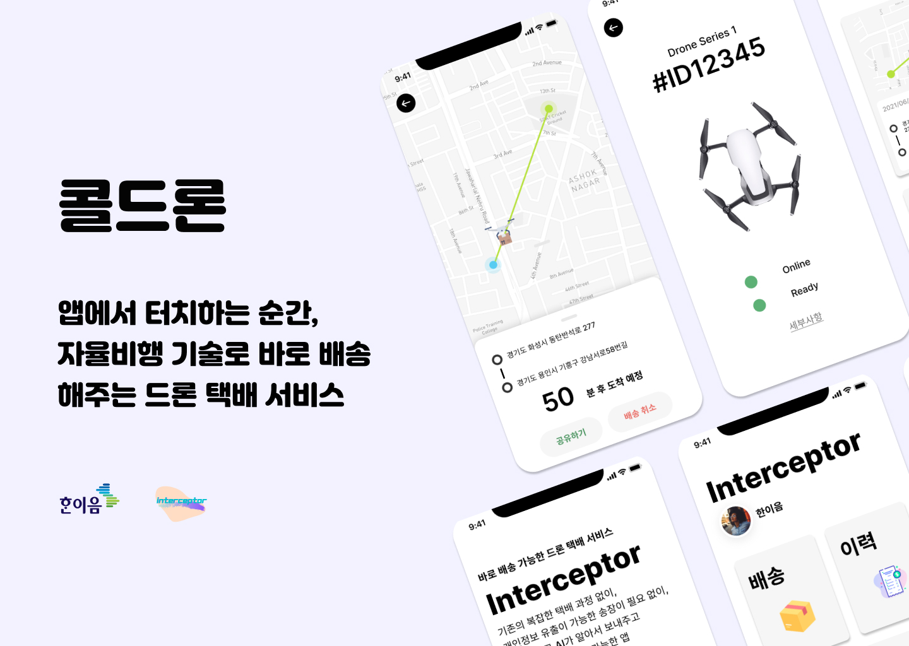
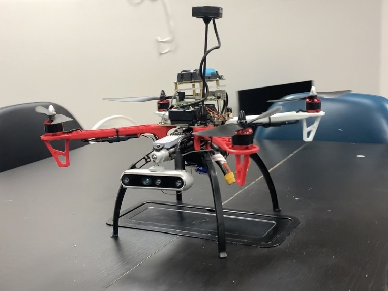

# 콜드론

## 팀명 및 정보
 

- 팀명  
인터셉터(Interceptor)

- 정보  
한이음 코드 : 21_HI024  
프로젝트명  : 콜드론  
작품명     : 가져다드리온

 

## 팀원 소개 및 역할
 

- 멘토
    - 임영섭 멘토 : 멘티들의 전문적인 진행 관리 
- 멘티
    - HW 부문
        - 유재석 : 드론의 물리적 설계 및 제작 
        - 최원영 : 전원 공급 설계 및 센서 조작 
    - SW 부문
        - 전민재(팀장) : 장애물 회피 알고리즘 및 영상 처리
        - 지정훈 : 드론의 소프트웨어 제어  
        - 이상혁 : 어플 및 클라우드 개발 

 

## 프로젝트 소개
 
코로나바이러스(COVID19)로 인해 비대면 소통이 이루어지는 시대에 물류 서비스 규모가 확장되고 있다. 언택트 물류 서비스의 발전은 향후 공중에서의 물류 서비스 수요 상승 가능성을 내포한다.

콜드론 서비스는 무인 드론 배송서비스를 지원하며 앞으로의 산업화를 목표로 최소한의 센서인 카메라만을 이용하여 경량화 및 시장성을 확보하였고 다양한 활용성을 부여하기 위하여 물류를 배송할 수 있는 수단을 추가하여 무인으로 목표를 완수하는 드론으로써 개발하고 있다. 사용자들은 앱을 통해 배송서비스를 이용할 수 있다.  
 

## 주요 기능
 

1. 깊이 추정 기술을 활용한 장애물 회피
2. 기존의 깊이 추정 방식의 문제점을 인공지능 학습으로 개선한 기술 적용
3. 어플리케이션으로 드론 택배 서비스 이용
   - 출발지 / 도착지 설정으로 드론 배송
   - 실시간 드론 위치 확인
   - 드론 상태에 대한 모니터링 
   - 드론 배송 이력 조회
4. 클라우드 서비스를 활용한 통신

 

## 서비스 흐름도
 

|4|5|
|:--:|:--:|
|||
|6|7|
|||
|8|9|
|||

① : 사용자는 어플을 통해 배송 요청을 할 수 있으며 클라우드(IoT Core)로 전송  
② : 클라우드(IoT Core)의 정보를 감지하여 Raspberry Pi에 전송  
③ : Raspberry Pi에서 정보의 요청 상태를 확인하고 드론을 실행  
④ : 드론이 물품을 픽업  
⑤ : GPS 정보를 활용해 목표 지점까지 이동  
⑥, ⑦ : 이동 도중에 장애물이 인식되면 회피하면서 이동  
⑧, ⑨ : 목적지 반경 내에 도착하면 착지 후 물품을 내려놓음  
⑩ : 비행 성공에 대한 정보를 클라우드(IoT Core)에 전송  
⑪ : 클라우드(IoT Core)의 정보를 감지하여 Serverless(Lambda)를 이용하여 DB 저장  
⑫ : 배송 이력을 확인하고 싶으면 해당하는 사용자 ID를 찾아 DB 데이터 필터링  
⑬ : 필터링 된 배송 이력 데이터는 API Gateway를 이용해 REST API로 전송하여 어플에서 확인 가능  

 

## 기술 스택 및 구성도
 

Hardware

- 비행장치(Pixhawk)
- UPS 모듈(5V 4A)
- Intel RealSense D455(깊이 추정 카메라)
- Raspberry Pi 4(8GB)
- 드론 부품
  -  F450 드론 프레임, 렌딩기어
  -  GPS 모듈
  -  모터 4개(2212 920KV)
  -  ESC 4개(OPTO, 30A)
  -  프로펠러 4개
  -  배터리(2600mAh, 15V, 4Cell)

Software

- AI / Image Processing
    - Image Segmentation
        - U-Net 구조를 활용한 Depth 데이터 개선
        - Depth의 Denoising 및 Hole Filling 기능
- Communication
    - AWS IoT Core
        - 라즈베리파이 WiFi 모듈을 활용해 적용
        - MQTT를 활용한 통신 방법
- Web / Application
    - 드론 제어(경로 설정) 및 실시간 모니터링 상태 확인 기능 탑재
    - 네이버 / 카카오 지도 API를 활용한 경로 지정
    - DynamoDB 및 API Gateway를 활용한 배송 이력 조회
- Drone
    - DroneKit를 활용한 드론 제어

사용한 프로그래밍 언어 : Python, Javascript

.env 목록 : 어플이나 드론 코드를 실행 시, 서비스 이용을 위한 인증 키 필요  
1. Google Login API
2. Kakao Maps API 
3. AWS IoT(Cognito, 사물 인증서)
4. AWS API Gateway 
5. OpenWeather API

 

## 제품 사진
 

 

 

## 동작 영상
 

 

## 참고 자료
 

- 인텔 리얼센스 공식 문서 : [Intel RealSense](https://dev.intelrealsense.com/docs?_ga=2.217913750.1236554375.1634310027-1786793082.1620377693)
- 드론 펌웨어 공식 문서 : [Ardupilot](https://ardupilot.org/dev/index.html)
- 드론 소프트웨어 API 문서 : [DroneKit](https://dronekit-python.readthedocs.io/en/latest/automodule.html)
- Depth 개선 모델 문서 : [U-Net](https://github.com/zhixuhao/unet)
- Coral 사용 예제 : [Coral](https://coral.ai/examples/)
- 드론 시뮬레이션 : [Ardupilot With Gazebo](https://ardupilot.org/dev/docs/using-gazebo-simulator-with-sitl.html)
- 앱 개발 문서 : [React Native](https://reactnative.dev/)
- 앱 시뮬레이션 문서 : [Expo](https://docs.expo.dev/)
- 클라우드 서비스 문서 : [AWS](https://docs.aws.amazon.com/index.html?nc2=h_ql_doc_do_v)
- Kakao Maps API 문서 : [Kakao Maps Web](https://apis.map.kakao.com/web/)

